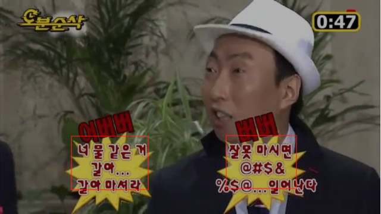

# Infinite Challenge [South Korea]
"Challenge is Infinite". Infinite Challenge is a South Korean television entertainment program, distributed and syndicated by MBC.

> Infinite Challenge is recognized as the first "Real-Variety" show in Korean television history. The program is largely unscripted, filmed in almost-secrecy and followed a similar format of challenge-based reality television programs. The challenges are often absurd or impossible to achieve, so the program takes on the satirical comedy aspect of a variety show rather than a standard reality or competition program. In earlier episodes, the show's six hosts and staff would continuously proclaim that, in order to achieve its comedic purposes, the program had to be "3-D": Dirty, Dangerous, and Difficult.[14] It gives people fun to try things that seem impossible.
[Wikipedia](https://en.wikipedia.org/wiki/Infinite_Challenge)

# Project Overview
## Skulls (i.e. Skullmark)

[_Captured from MBC TV Show 'Infinite Challenge 무한도전'_]

One of the unique characteristics of Infinite Challenge is their visual effects and video editing. It is famous for 
its unique **skull mark**, a visual effect which the editors of the show place near a the member's face/body, to express
a member's sudden embarrassment or sometimes humiliation during interactions between the members and guests. 

## Objective
Our goal is to count the number of times each member was marked with a **skull mark** throughout the entire series, and 
visualise the processed data.

## Methodology
To automate the process of recording each instance of a member being marked with a **skull mark**, we use Facial 
Detection, Facial Recognition, Object Detection and Data Visualisation Tools. 

# Project Description
## Data Pipeline

1. In order to reduce the number of frames we need to process for each episode, we first use object detection to find frames which contain **skull marks** and record relevant data such as:
	*	Timestamp of the frame skulls were detected in
	*	Location of the bounding boxes of each **skull mark** detected.
2. We then process these filtered frames and
	1. locate each face in the frame, and
	2. identify the faces that were detected.
	Once again, we record relevant data such as the location of the bounding boxes of each face detected.
3. Using the data from previous 2 steps, we can now attempt to determine which member was marked in frames which contain both **skull mark(s)** and identified face(s), and record the results onto a database.
4. Once we have processed the episodes, we can visualize the data using data in the database using data visualisation software.

# Implementation
## Phase 1: Skull Detection

In Phase 1 of the data pipeline, we first download an episode of the show and sample frames within the video using a specified sample period (in milliseconds). A higher sample period means more frames are skipped, which leads to faster processing speed but with a trade-off of an increased chance of missing frames containing a skull.
We used a sample period of `1300` ms, which gives us a good balanced between the two aforementioned factors.

For each frame sampled, the script detects whether a skull is present. We chose to use `Custom Vision` from `Azure Cognitive Services` to train a custom model for two reasons:
 * `Custom Vision` is significantly superior to using local model and detection scripts in terms of speed, and
 * The results of previous predictions are readily available via online portal for manual interpretation and reusing as training data to improve our model.

Notably, we discovered that our previous model frequently confuses text blocks with special effects with skulls. Therefore, we trained our model with dummy labels representing typical types of text blocks in _Infinite Challenge_ episodes to achieve better performance.

In the final stage of Phase 1, the script caches all frames with skull(s) detected, attached with their skull locations in a `csv` file, for later processing in the pipeline.

## Phase 2: Facial Recognition

Once phase 1 completes collecting images where skull is detected from the episode file, Face recognition will come in to play 
_(above image is the sample result image created by our python script)_

We used `Azure Cognitive Services` from MS, instead of using local facial_recognition model. This was because using cloud services allowed faster processing speed, and it provided significantly higher matching accuracy compared to using OpenCv-Face Recognition Model.

For each image saved from phase 2, recognised face with boundaries will be labeled in the image and uploaded automatically, together with the CSV results into our Google Drive for better
analysis.

## Phase 3: Analysis & Estimation
## *Batch Processing (Discontinued)*
